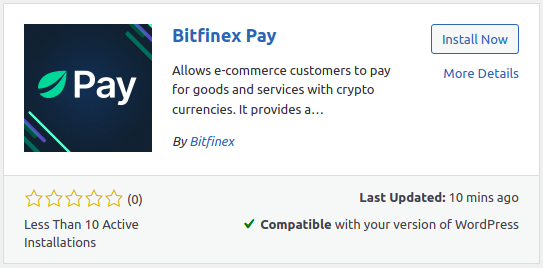

# bfx-pay-woocommerce
Allows e-commerce customers to pay for goods and services with crypto currencies. It provides a payment gateway that could be used by any e-commerce to sell their products and services as long as they have an Intermediate-verified (or higher KYC level) Merchant account on the Bitfinex platform.

## How to install
**Make sure the WooCommerce plugin is installed before starting installation.**

**From WP directory**

1. Go to the WordPress admin panel then navigate to the `Plugins` > `Add New` from the left sidebar.
2. Search for `bitfinex-pay`
3. Click install under `Bitfinex Pay` plugin, see screenshot below

4. Once installed click `Activate Plugin`
5. Install plugin WP Mail SMTP or other and configure mail settings.

**From GitHub**

1. Download the `bitfinex-pay.zip` file from latest release on github page.
2. Go to the WordPress admin panel then navigate to the `Plugins` > `Add New` from the left sidebar.
3. Click to the `Upload Plugin` button at the top of the page.
4. Select the `bitfinex-pay.zip` file which was downloaded on step 1 and click the `Install Now` button. Don't forget to activate the plugin by the `Activate Plugin` button at the bottom of the page.
5. Install plugin WP Mail SMTP or other and configure mail settings.

### Configuration
1. First of all you should activate Bitfinex payment method, to do that open `WooCommerce` > `Settings` > `Payments` and click `Set up` on `Bitfinex Payment` method.
2. Enter your Public and Secret keys from the Bitfinex platform in the proper fields and set all ticks to enable.
3. Make sure that the webhook address `https://your-domain?wc-api=bitfinex` is available to get incoming requests.

## Test Locally
1. Run `composer install`.
2. Create a zip archive by running `make build`.
3. Follow steps 2-5 from [How to install](#how-to-install) on github section.
